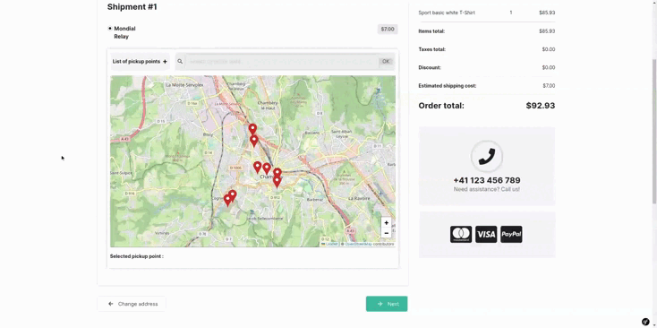

<p align="center">
</p>


<h1 align="center">Asdoria Sylius Pickup Point Plugin</h1>

<p align="center">
This plugin allows you to retrieve and use pickup points from different
providers in your Sylius Shop
</p>

<div style="max-width: max-content; height: auto; margin: auto">



</div>

## Installation

### Require plugin with composer:

```bash
$ composer require asdoria/sylius-pickup-point-plugin
```

### Register bundles in `config/bundles.php`:

```php
[...]
Bazinga\Bundle\JsTranslationBundle\BazingaJsTranslationBundle::class => ['all' => true],
Setono\SyliusPickupPointPlugin\SetonoSyliusPickupPointPlugin::class => ['all' => true],
Asdoria\SyliusPickupPointPlugin\AsdoriaSyliusPickupPointPlugin::class => ['all' => true],
FOS\JsRoutingBundle\FOSJsRoutingBundle::class => ['all' => true],
[...]
```

### Import configuration:

```yaml
# config/packages/asdoria_sylius_pickup_point.yaml
imports:
    - { resource: "@SetonoSyliusPickupPointPlugin/Resources/config/app/config.yaml" }
    - { resource: "@AsdoriaSyliusPickupPointPlugin/Resources/config/config.yaml" }

setono_sylius_pickup_point:
    resources:
        pickup_point:
            classes:
                model: Asdoria\SyliusPickupPointPlugin\Entity\PickupPoint

asdoria_sylius_pickup_point:
    chrono_relay:
        enabled: true
        options:
            accountNumber: JOHNDOE
            password: 123456
    mondial_relay:
        enabled: false
        options:
            accountNumber: JOHNDOE
            password: 123456
    colissimo_relay:
        enabled: false
        options:
            accountNumber: JOHNDOE
            password: 123456
    shop2shop_relay:
        enabled: false
        options:
            accountNumber: JOHNDOE
            password: 123456
            maxPointChronopost: 20
    dpd_relay:
        enabled: false
        options:
            key: KEY
```

### Import routes:

```yaml
# config/routes/setono_sylius_pickup_point.yaml
setono_sylius_pickup_point_plugin:
    resource: "@SetonoSyliusPickupPointPlugin/Resources/config/routing.yaml"

# config/routes/fos_js_routing.yaml
fos_js_routing:
    resource: "@FOSJsRoutingBundle/Resources/config/routing/routing-sf4.xml"
    prefix: /{_locale}

# config/packages/js_translation.yaml
bazinga_js_translation:
    resource: "@BazingaJsTranslationBundle/Resources/config/routing/routing.yml"
    prefix: /{_locale}
```

### Paste the following content to the `src/Entity/Shipping/Shipment.php file`:

```php
<?php

declare(strict_types=1);

namespace App\Entity;

use Doctrine\ORM\Mapping as ORM;
use Setono\SyliusPickupPointPlugin\Model\PickupPointAwareTrait;
use Setono\SyliusPickupPointPlugin\Model\ShipmentInterface;
use Sylius\Component\Core\Model\Shipment as BaseShipment;

/**
 * @ORM\Entity()
 * @ORM\Table(name="sylius_shipment")
 */
class Shipment extends BaseShipment implements ShipmentInterface
{
    use PickupPointAwareTrait;
}
```

### If you don't use annotations, add `Shipment.orm.xml`:

```xml
<?xml version="1.0" encoding="UTF-8"?>

<doctrine-mapping xmlns="http://doctrine-project.org/schemas/orm/doctrine-mapping">

    <mapped-superclass name="App\Entity\Shipping\Shipment" table="sylius_shipment">
        <field name="pickupPointId" column="pickup_point_id" nullable="true"/>
    </mapped-superclass>
</doctrine-mapping>
```

### Paste the following content to the `src/Entity/Shipping/ShippingMethod.php file`:

```php
<?php

declare(strict_types=1);

namespace App\Entity;

use Doctrine\ORM\Mapping as ORM;
use Setono\SyliusPickupPointPlugin\Model\PickupPointProviderAwareTrait;
use Setono\SyliusPickupPointPlugin\Model\ShippingMethodInterface;
use Sylius\Component\Core\Model\ShippingMethod as BaseShippingMethod;

/**
 * @ORM\Entity()
 * @ORM\Table(name="sylius_shipping_method")
 */
class ShippingMethod extends BaseShippingMethod implements ShippingMethodInterface
{
    use PickupPointProviderAwareTrait;
}
```

### If you don't use annotations, add `ShippingMethod.orm.xml`:

```xml
<?xml version="1.0" encoding="UTF-8"?>

<doctrine-mapping xmlns="http://doctrine-project.org/schemas/orm/doctrine-mapping">

    <mapped-superclass name="App\Entity\Shipping\ShippingMethod" table="sylius_shipping_method">
        <field name="pickupPointProvider" column="pickup_point_provider" nullable="true"/>
    </mapped-superclass>
</doctrine-mapping>
```

### Tell Sylius to use your own extended resources in `config/packages/_sylius.yaml`:

```yaml
sylius_shipping:
    resources:
        shipment:
            classes:
                model: App\Entity\Shipping\Shipment
        shipping_method:
            classes:
                model: App\Entity\Shipping\ShippingMethod
```

### Update schema database

```bash
bin/console doctrine:migrations:diff
bin/console doctrine:migrations:migrate 
```

### Run following commands:

```bash
bin/console cache:clear
bin/console fos:js-routing:dump --format=json --target=public/js/fos_js_routes.json
bin/console bazinga:js-translation:dump public/js --format=json
bin/console sylius:install:assets
```

## Front

### 0/ Admin

Add `{{ form_row(form.pickupPointProvider) }}` in ShippingMethod form. You can copy the template overrides from the
plugin directory :

```
From: [shop_dir] vendor/asdoria/sylius-pickup-point-plugin/src/Resources/views/bundles/SyliusAdminBundle/*
To: [shop_dir] templates/bundles/SyliusAdminBundle/*
```

### 1/ Steps

1) In `templates/bundles/SyliusShopBundle/Checkout/selectShipping.html.twig`, put react instance
   element with class `react-pickup-point` and locale with `data-pkp-locale="{{ app.request.locale }}"`

```html

[...]

<div class="react-pickup-point"
     data-pkp-locale="{{ app.request.locale }}"
     data-pkp-height="500px"
     data-pkp-height-mobile="250px"></div>

```

2) In `templates/bundles/SyliusShopBundle/Checkout/SelectShipping/_shipment.html.twig`,
   put `<input type="hidden">` with class `react-pickup-point-input-hidden`

```html


<div>
    {{ form_errors(form.method) }}

    
        
        
        
    
        
    

    {#
    <div class="react-pickup-point" data-pkp-height="500px"></div>
    #}

    
        {{ form_widget(form.pickupPointId, {'attr': {'class': 'react-pickup-point-input-hidden'}}) }}
        {{- form_errors(form.pickupPointId) -}}
    
</div>
```

3) In your JS context, you must create a new entrypoint in webpack.

```js
.addEntry('pickup-point', [
    './assets/shop/js/app/pickup-point.js'
])
```

4) In `templates/bundles/SyliusShopBundle/Checkout/selectShipping.html.twig`,
   call javascripts and stylesheets events, and `pickup-point` script after other scripts.

```html

    {{ parent() }}
    {{ sylius_template_event('asdoria.pickup.point.stylesheets') }}



    {{ parent() }}
    {{ sylius_template_event('asdoria.pickup.point.javascripts') }}
    {{ encore_entry_script_tags('pickup-point', null, 'shop') }}

```

5) In `assets/shop/js/common/constants/events.js`, export constants

```js
export const EVENT_INSTANCE_PICKUP_POINT       = 'EVENT_INSTANCE_PICKUP_POINT'
export const EVENT_SET_PICKUP_POINT            = 'EVENT_SET_PICKUP_POINT'
export const EVENT_HIDE_PICKUP_POINT           = 'EVENT_HIDE_PICKUP_POINT'
export const EVENT_UPDATE_CURRENT_PICKUP_POINT = 'EVENT_UPDATE_CURRENT_PICKUP_POINT'
```

6) Create the file `assets/shop/js/app/pickup-point.js`

```js
import {
    EVENT_INSTANCE_PICKUP_POINT,
    EVENT_SET_PICKUP_POINT,
    EVENT_HIDE_PICKUP_POINT,
    EVENT_UPDATE_CURRENT_PICKUP_POINT
} from '../common/constants/events'

document.addEventListener('DOMContentLoaded', async () => {
    const providersWithPickupPoint = [...document.querySelectorAll('input.input-shipping-method[data-pickup-point-provider]')]
    if (!providersWithPickupPoint.length) return

    const providerCheckedByDefault = providersWithPickupPoint.find(providerHTML => providerHTML.checked)

    const paramsForEventBus = {}

    if (providerCheckedByDefault) {
        const elToTeleportPickupPoint = getElToTeleportPickupPoint(providerCheckedByDefault)

        if (!elToTeleportPickupPoint) return

        paramsForEventBus.providerCode = providerCheckedByDefault.dataset?.pickupPointProvider
        paramsForEventBus.csrfToken    = providerCheckedByDefault.dataset?.csrfToken

        eventBus.dispatchEvent(EVENT_INSTANCE_PICKUP_POINT, {
            ...paramsForEventBus,
            elToTeleport: elToTeleportPickupPoint
        })
    }

    providersWithPickupPoint.forEach(providerWithPickupPoint => {
        providerWithPickupPoint.addEventListener('change', (e) => {
            const elToTeleportPickupPoint = getElToTeleportPickupPoint(e.target)

            if (!elToTeleportPickupPoint) return

            const instanceAppReact = document.querySelector('.pkp-app, .pkp-app-error')

            paramsForEventBus.providerCode = e.target.dataset?.pickupPointProvider
            paramsForEventBus.csrfToken    = e.target.dataset?.csrfToken

            if (instanceAppReact) {
                eventBus.dispatchEvent(EVENT_SET_PICKUP_POINT, {
                    ...paramsForEventBus,
                    elToTeleport: elToTeleportPickupPoint
                })

                return
            }

            eventBus.dispatchEvent(EVENT_INSTANCE_PICKUP_POINT, {
                ...paramsForEventBus,
                elToTeleport: elToTeleportPickupPoint
            })
        })
    })

    const providersWithoutPickupPoint = [...document.querySelectorAll('input.input-shipping-method:not([data-pickup-point-provider])')]

    providersWithoutPickupPoint.forEach(providerWithoutPickupPoint => {
        providerWithoutPickupPoint.addEventListener('change', (e) => {
            eventBus.dispatchEvent(EVENT_HIDE_PICKUP_POINT)
        })
    })

    updateCurrentPoint()
})

/**
 *
 * @param inputRadio
 * @returns {*|null}
 */
const getElToTeleportPickupPoint = (inputRadio) => {
    const reactParentTeleportPickupPoint = inputRadio.closest('.react-parent-teleport-pickup-point')

    if (!reactParentTeleportPickupPoint) return null

    const elToTeleportPickupPoint = reactParentTeleportPickupPoint.querySelector('.react-teleport-pickup-point')

    if (!elToTeleportPickupPoint) return null

    return elToTeleportPickupPoint
}

const updateCurrentPoint = () => {
    const elInstance  = document.querySelector('.react-pickup-point')
    const inputHidden = document.querySelector('.react-pickup-point-input-hidden')

    if (!elInstance || !inputHidden) return

    eventBus.addEventListener(EVENT_UPDATE_CURRENT_PICKUP_POINT, ({ detail: getCurrentPoint }) => {
        inputHidden.value = getCurrentPoint?.code || null
    })
}
```

7) Map will teleport in current choice of provider. To do it,
   in `templates/bundles/SyliusShopBundle/Checkout/SelectShipping/_choice.html.twig`
   put class `react-parent-teleport-pickup-point` in choice container, and class `react-teleport-pickup-point` in a
   child `<div>` of this container.

```html



<div class=" react-parent-teleport-pickup-point">
    {{ form_row(form, sylius_test_form_attribute('shipping-method-select')) }}

    [...]

    
    <div class="react-teleport-pickup-point"></div>
    
</div>
```

### 2/ Options

|          Data attribute          |            Value             |         Explication         |                         Default Value                          |
|:--------------------------------:|:----------------------------:|:---------------------------:|:--------------------------------------------------------------:|
|        `data-pkp-height`         |              px              |      Set height of map      |                             400px                              |
|     `data-pkp-height-mobile`     |              px              | Set height of map on mobile |                             250px                              |
|      `data-pkp-marker-icon`      |            string            |  Set marker icon with path  | /bundles/asdoriasyliuspickuppointplugin/images/marker-icon.png |
|         `data-pkp-zoom`          |             int              |       Set zoom of map       |                               13                               |
|      `data-pkp-filter-shop`      |            0 or 1            |     Enable shops filter     |                               0                                |
|     `data-pkp-zoom-control`      |            0 or 1            |    Display zoom controls    |                               1                                |
|   `data-pkp-scroll-wheel-zoom`   |            0 or 1            |    Enable zoom on scroll    |                               0                                |
| `data-pkp-zoom-control-position` | bottomleft, topright, etc... |  Position of zoom controls  |                          bottomright                           |

```html

<div class="react-pickup-point"
     data-pkp-height="500px"
     data-pkp-height-mobile="250px"
     data-pkp-zoom="12"
     data-pkp-filter-shop="1"
     data-pkp-zoom-control="0"
     data-pkp-scroll-wheel-zoom="1"
     data-pkp-zoom-control-position="topleft">
    
    {{ form_row(form.pickupPointId) }}
    
</div>
```
